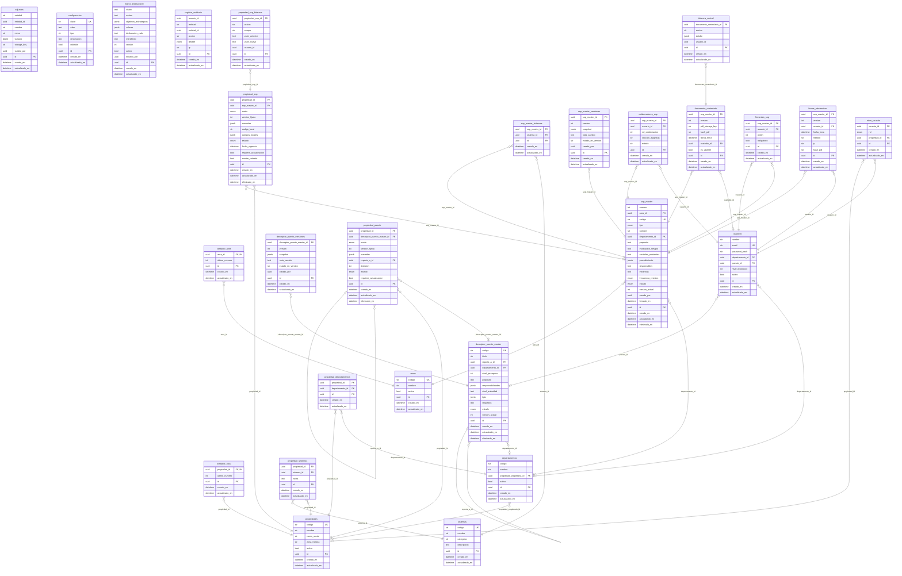

# Modelo de datos — CRC Operations Manual Hub

Diagrama ER generado desde el metadata de SQLAlchemy (Etapa 2). 27 tablas, PK UUID, enums en español.

```mermaid
erDiagram
    adjuntos {
        str entidad
        uuid entidad_id
        str nombre
        str mime
        bigint tamano
        str storage_key
        uuid subido_por
        uuid id "PK"
        datetime creado_en
        datetime actualizado_en
    }
    areas {
        str codigo "UK"
        str nombre
        bool activo
        uuid id "PK"
        datetime creado_en
        datetime actualizado_en
    }
    configuracion {
        str clave "UK"
        text valor
        str tipo
        text descripcion
        bool editable
        uuid id "PK"
        datetime creado_en
        datetime actualizado_en
    }
    marco_institucional {
        text vision
        text mision
        jsonb objetivos_estrategicos
        jsonb valores
        text declaracion_valor
        text manifiesto
        int version
        bool activo
        uuid editado_por
        uuid id "PK"
        datetime creado_en
        datetime actualizado_en
    }
    propiedades {
        str codigo "UK"
        str nombre
        str razon_social
        str zona_horaria
        bool activo
        uuid id "PK"
        datetime creado_en
        datetime actualizado_en
    }
    registro_auditoria {
        uuid usuario_id
        str entidad
        uuid entidad_id
        str accion
        jsonb detalle
        str ip
        uuid id "PK"
        datetime creado_en
        datetime actualizado_en
    }
    sistemas {
        str codigo "UK"
        str nombre
        str categoria
        text descripcion
        uuid id "PK"
        datetime creado_en
        datetime actualizado_en
    }
    contador_area {
        uuid area_id "FK,UK"
        int ultimo_numero
        uuid id "PK"
        datetime creado_en
        datetime actualizado_en
    }
    contador_local {
        uuid propiedad_id "FK,UK"
        int ultimo_numero
        uuid id "PK"
        datetime creado_en
        datetime actualizado_en
    }
    departamentos {
        str codigo
        str nombre
        uuid propiedad_propietaria_id "FK"
        bool activo
        uuid id "PK"
        datetime creado_en
        datetime actualizado_en
    }
    propiedad_sistemas {
        uuid propiedad_id "FK"
        uuid sistema_id "FK"
        text notas
        uuid id "PK"
        datetime creado_en
        datetime actualizado_en
    }
    descriptor_puesto_master {
        str codigo "UK"
        str titulo
        uuid reporta_a_id "FK"
        uuid departamento_id "FK"
        int nivel_jerarquico
        text proposito
        jsonb responsabilidades
        text nivel_autoridad
        jsonb kpis
        text requisitos
        enum estado
        int version_actual
        uuid id "PK"
        datetime creado_en
        datetime actualizado_en
        datetime eliminado_en
    }
    propiedad_departamentos {
        uuid propiedad_id "FK"
        uuid departamento_id "FK"
        uuid id "PK"
        datetime creado_en
        datetime actualizado_en
    }
    sop_master {
        int numero
        uuid area_id "FK"
        str codigo "UK"
        enum tipo
        str nombre
        uuid departamento_id "FK"
        text proposito
        text evaluacion_riesgos
        text controles_existentes
        jsonb procedimiento
        text responsables
        text evidencia
        enum frecuencia_revision
        enum estado
        int version_actual
        uuid creado_por
        datetime firmado_en
        uuid id "PK"
        datetime creado_en
        datetime actualizado_en
        datetime eliminado_en
    }
    descriptor_puesto_versiones {
        uuid descriptor_puesto_master_id "FK"
        int version
        jsonb snapshot
        text nota_cambio
        str estado_en_version
        uuid creado_por
        uuid id "PK"
        datetime creado_en
        datetime actualizado_en
    }
    propiedad_puesto {
        uuid propiedad_id "FK"
        uuid descriptor_puesto_master_id "FK"
        enum modo
        int version_fijada
        jsonb overrides
        uuid reporta_a_id "FK"
        int dotacion
        enum estado
        bool requiere_actualizacion
        uuid id "PK"
        datetime creado_en
        datetime actualizado_en
        datetime eliminado_en
    }
    propiedad_sop {
        uuid propiedad_id "FK"
        uuid sop_master_id "FK"
        enum modo
        int version_fijada
        jsonb overrides
        str codigo_local
        jsonb campos_locales
        enum estado
        datetime fecha_vigencia
        bool requiere_actualizacion
        bool master_retirado
        uuid id "PK"
        datetime creado_en
        datetime actualizado_en
        datetime eliminado_en
    }
    sop_master_sistemas {
        uuid sop_master_id "FK"
        uuid sistema_id "FK"
        uuid id "PK"
        datetime creado_en
        datetime actualizado_en
    }
    sop_master_versiones {
        uuid sop_master_id "FK"
        int version
        jsonb snapshot
        text nota_cambio
        str estado_en_version
        uuid creado_por
        uuid id "PK"
        datetime creado_en
        datetime actualizado_en
    }
    usuarios {
        str nombre
        str email "UK"
        str password_hash
        uuid departamento_id "FK"
        uuid puesto_id "FK"
        int nivel_jerarquico
        bool activo
        uuid id "PK"
        datetime creado_en
        datetime actualizado_en
    }
    colaboradores_sop {
        uuid sop_master_id "FK"
        uuid usuario_id "FK"
        str rol_colaboracion
        str seccion_asignada
        str estado
        uuid id "PK"
        datetime creado_en
        datetime actualizado_en
    }
    documento_controlado {
        uuid sop_master_id "FK"
        int version
        str pdf_storage_key
        str hash_pdf
        datetime fecha_firma
        uuid custodio_id "FK"
        bool es_vigente
        uuid id "PK"
        datetime creado_en
        datetime actualizado_en
    }
    firmantes_sop {
        uuid sop_master_id "FK"
        uuid usuario_id "FK"
        int orden
        bool obligatorio
        uuid id "PK"
        datetime creado_en
        datetime actualizado_en
    }
    firmas_electronicas {
        uuid sop_master_id "FK"
        int version
        uuid usuario_id "FK"
        datetime fecha_hora
        str metodo
        str ip
        str hash_pdf
        uuid id "PK"
        datetime creado_en
        datetime actualizado_en
    }
    propiedad_sop_bitacora {
        uuid propiedad_sop_id "FK"
        str accion
        str campo
        text valor_anterior
        text valor_nuevo
        uuid usuario_id
        uuid id "PK"
        datetime creado_en
        datetime actualizado_en
    }
    roles_usuario {
        uuid usuario_id "FK"
        enum rol
        uuid propiedad_id "FK"
        uuid id "PK"
        datetime creado_en
        datetime actualizado_en
    }
    bitacora_control {
        uuid documento_controlado_id "FK"
        str accion
        jsonb detalle
        uuid usuario_id
        uuid id "PK"
        datetime creado_en
        datetime actualizado_en
    }
    contador_area }o--|| areas : area_id
    contador_local }o--|| propiedades : propiedad_id
    departamentos }o--o| propiedades : propiedad_propietaria_id
    propiedad_sistemas }o--|| propiedades : propiedad_id
    propiedad_sistemas }o--|| sistemas : sistema_id
    descriptor_puesto_master }o--o| departamentos : departamento_id
    descriptor_puesto_master }o--o| descriptor_puesto_master : reporta_a_id
    propiedad_departamentos }o--|| departamentos : departamento_id
    propiedad_departamentos }o--|| propiedades : propiedad_id
    sop_master }o--o| departamentos : departamento_id
    sop_master }o--|| areas : area_id
    descriptor_puesto_versiones }o--|| descriptor_puesto_master : descriptor_puesto_master_id
    propiedad_puesto }o--o| descriptor_puesto_master : descriptor_puesto_master_id
    propiedad_puesto }o--|| propiedades : propiedad_id
    propiedad_puesto }o--o| propiedad_puesto : reporta_a_id
    propiedad_sop }o--|| propiedades : propiedad_id
    propiedad_sop }o--o| sop_master : sop_master_id
    sop_master_sistemas }o--|| sistemas : sistema_id
    sop_master_sistemas }o--|| sop_master : sop_master_id
    sop_master_versiones }o--|| sop_master : sop_master_id
    usuarios }o--o| departamentos : departamento_id
    usuarios }o--o| descriptor_puesto_master : puesto_id
    colaboradores_sop }o--|| usuarios : usuario_id
    colaboradores_sop }o--|| sop_master : sop_master_id
    documento_controlado }o--o| usuarios : custodio_id
    documento_controlado }o--|| sop_master : sop_master_id
    firmantes_sop }o--|| sop_master : sop_master_id
    firmantes_sop }o--|| usuarios : usuario_id
    firmas_electronicas }o--|| usuarios : usuario_id
    firmas_electronicas }o--|| sop_master : sop_master_id
    propiedad_sop_bitacora }o--|| propiedad_sop : propiedad_sop_id
    roles_usuario }o--|| usuarios : usuario_id
    roles_usuario }o--o| propiedades : propiedad_id
    bitacora_control }o--|| documento_controlado : documento_controlado_id
```
